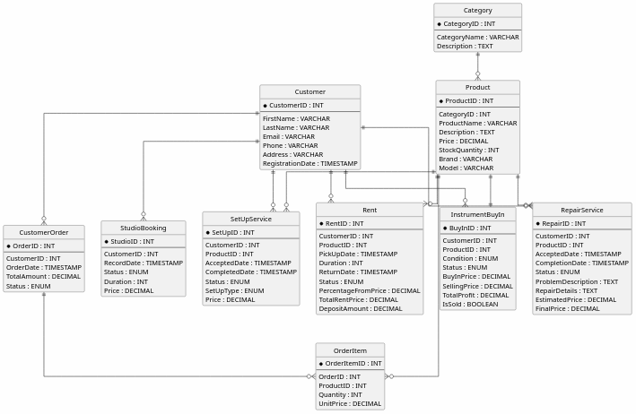

# Лабораторна робота №1

**Тема:** Збір вимог та розробка схеми ER  
**Виконав:** Вовк Андрій, Троценко Максим, група ІО-41

## Мета роботи
Зібрати та проаналізувати вимоги до інформаційної системи, виділити основні сутності, їх атрибути та зв'язки між ними, а також побудувати концептуальну ER-діаграму предметної області.

## Вихідні дані
Вихідними даними є опис предметної області інтернет-магазину гітар, сформульовані функціональні вимоги до зберігання даних, а також визначені бізнес-правила, на основі яких виділяються сутності, їх атрибути та зв'язки для побудови ER-діаграми.

## Опис системи та збір вимог
Для виконання лабораторної роботи було обрано предметну область інтернет-магазину гітар. Така система повинна зберігати інформацію про товари, клієнтів і історію їхніх покупок. Обрана тема має зручну структуру для побудови реляційної бази даних, оскільки містить типові бізнес-процеси: облік товарів, оформлення замовлень, збереження даних про покупців, оренду інструментів, запис до студії самозапису, викуп уживаних інструментів, а також послуги ремонту і налаштування.

Основні бізнес-правила та завдання системи:
- магазин продає гітари різних типів, зокрема акустичні, електрогітари, бас-гітари та інші музичні інструменти;
- кожен товар належить до певної категорії та має власний бренд, модель, ціну і залишок на складі;
- клієнт повинен бути зареєстрований у системі, щоб оформити замовлення;
- один клієнт може зробити багато замовлень;
- одне замовлення може містити декілька різних товарів;
- для кожного замовлення система повинна зберігати адресу доставки;
- система повинна зберігати історію покупок із фіксацією ціни товару на момент придбання;
- магазин також надає послугу оренди музичних інструментів, при цьому для кожної оренди зберігаються дата отримання, дата повернення, тривалість, статус, сума застави та вартість оренди;
- магазин має студію самозапису з однією кімнатою, тому система повинна зберігати записи клієнтів до студії, дату та час запису, тривалість, статус і вартість послуги;
- магазин може викуповувати вживані інструменти у клієнтів для подальшого продажу;
- після викупу інструмента в клієнта для нього створюється новий запис у таблиці `Product`, що забезпечує уніфіковане зберігання інформації про всі товари магазину;
- для кожної операції викупу система повинна зберігати стан інструмента, статус операції, ціну викупу, заплановану ціну продажу, ознаку факту продажу та очікуваний або фактичний прибуток;
- магазин також надає послуги ремонту та налаштування музичних інструментів;
- для ремонту система повинна зберігати дату прийняття, дату завершення, статус, опис проблеми, перелік виконаних робіт, попередню та фінальну вартість;
- для налаштування система повинна зберігати дату прийняття, дату завершення, статус, тип налаштування та вартість послуги.

## Сутності та їх атрибути

### Клієнт (`Customer`)
- `CustomerID` (`INT`) — первинний ключ, унікальний ідентифікатор клієнта;
- `FirstName` (`VARCHAR`) — ім'я клієнта;
- `LastName` (`VARCHAR`) — прізвище клієнта;
- `Email` (`VARCHAR`) — електронна пошта, унікальне значення;
- `Phone` (`VARCHAR`) — номер телефону;
- `PasswordHash` (`VARCHAR`) — хеш пароля клієнта для автентифікації в системі.

### Категорія (`Category`)
- `CategoryID` (`INT`) — первинний ключ;
- `Name` (`VARCHAR`) — назва категорії, наприклад: "Електрогітари", "Акустичні гітари", "Укулеле";
- `Description` (`TEXT`) — текстовий опис категорії.

### Товар (`Product`)
- `ProductID` (`INT`) — первинний ключ;
- `CategoryID` (`INT`) — зовнішній ключ, посилання на категорію;
- `Brand` (`VARCHAR`) — бренд товару, наприклад: Fender, Gibson, Yamaha;
- `Model` (`VARCHAR`) — модель товару;
- `Price` (`DECIMAL`) — ціна товару, значення повинно бути більшим за нуль;
- `StockQuantity` (`INT`) — кількість одиниць товару на складі, значення не може бути від'ємним.

### Замовлення (`CustomerOrder`)
- `OrderID` (`INT`) — первинний ключ;
- `CustomerID` (`INT`) — зовнішній ключ, посилання на клієнта;
- `OrderDate` (`TIMESTAMP`) — дата і час оформлення замовлення;
- `Status` (`ENUM`) — поточний стан замовлення;
- `ShippingAddress` (`VARCHAR`) — адреса доставки замовлення;
- `TotalAmount` (`DECIMAL`) — загальна сума замовлення.

### Деталі замовлення (`OrderItem`)
- `OrderItemID` (`INT`) — первинний ключ;
- `OrderID` (`INT`) — зовнішній ключ, посилання на замовлення;
- `ProductID` (`INT`) — зовнішній ключ, посилання на товар;
- `Quantity` (`INT`) — кількість придбаних одиниць товару;
- `UnitPrice` (`DECIMAL`) — ціна одиниці товару на момент покупки.

Сутність `OrderItem` є асоціативною, оскільки вона реалізує зв'язок багато-до-багатьох між сутностями `CustomerOrder` і `Product`.

### Оренда (`Rent`)
- `RentID` (`INT`) — первинний ключ;
- `CustomerID` (`INT`) — зовнішній ключ, посилання на клієнта;
- `ProductID` (`INT`) — зовнішній ключ, посилання на товар;
- `PickUpDate` (`TIMESTAMP`) — дата і час отримання товару в оренду;
- `Duration` (`INT`) — тривалість оренди;
- `ReturnDate` (`TIMESTAMP`) — дата повернення товару;
- `Status` (`ENUM`) — поточний стан оренди;
- `PercentageFromPrice` (`DECIMAL`) — відсоток від ціни товару для розрахунку вартості оренди;
- `TotalRentPrice` (`DECIMAL`) — загальна вартість оренди;
- `DepositAmount` (`DECIMAL`) — сума застави.

### Запис у студію (`StudioBooking`)
- `StudioID` (`INT`) — первинний ключ;
- `CustomerID` (`INT`) — зовнішній ключ, посилання на клієнта;
- `RecordDate` (`TIMESTAMP`) — дата і час запису в студію;
- `Status` (`ENUM`) — поточний стан запису;
- `Duration` (`INT`) — тривалість сесії;
- `Price` (`DECIMAL`) — вартість самозапису.

### Викуп інструмента магазином (`InstrumentBuyIn`)
- `BuyInID` (`INT`) — первинний ключ;
- `CustomerID` (`INT`) — зовнішній ключ, посилання на клієнта;
- `ProductID` (`INT`) — зовнішній ключ, посилання на новостворений запис у таблиці `Product`;
- `Condition` (`ENUM`) — стан викупленого інструмента;
- `Status` (`ENUM`) — поточний стан операції викупу;
- `BuyInPrice` (`DECIMAL`) — ціна, за яку магазин придбав інструмент;
- `SellingPrice` (`DECIMAL`) — ціна, за якою інструмент буде виставлено на продаж;
- `TotalProfit` (`DECIMAL`) — очікуваний або фактичний прибуток від перепродажу;
- `IsSold` (`BOOLEAN`) — ознака того, чи був інструмент проданий.

### Ремонт інструмента (`RepairService`)
- `RepairID` (`INT`) — первинний ключ;
- `CustomerID` (`INT`) — зовнішній ключ, посилання на клієнта;
- `ProductID` (`INT`) — зовнішній ключ, посилання на товар;
- `AcceptedDate` (`TIMESTAMP`) — дата прийняття інструмента в ремонт;
- `CompletionDate` (`TIMESTAMP`) — дата завершення ремонту;
- `Status` (`ENUM`) — поточний стан ремонту;
- `ProblemDescription` (`TEXT`) — опис проблеми;
- `RepairDetails` (`TEXT`) — опис виконаних робіт;
- `EstimatedPrice` (`DECIMAL`) — попередня вартість ремонту;
- `FinalPrice` (`DECIMAL`) — фінальна вартість ремонту.

### Налаштування інструмента (`SetUpService`)
- `SetUpID` (`INT`) — первинний ключ;
- `CustomerID` (`INT`) — зовнішній ключ, посилання на клієнта;
- `ProductID` (`INT`) — зовнішній ключ, посилання на товар;
- `AcceptedDate` (`TIMESTAMP`) — дата прийняття інструмента на налаштування;
- `CompletedDate` (`TIMESTAMP`) — дата завершення налаштування;
- `Status` (`ENUM`) — поточний стан послуги;
- `SetUpType` (`ENUM`) — тип налаштування;
- `Price` (`DECIMAL`) — вартість послуги.

## Зв'язки між сутностями та кардинальність

### `Customer` - `CustomerOrder`
Між сутностями `Customer` і `CustomerOrder` існує зв'язок один-до-багатьох. Один клієнт може оформити багато замовлень, але кожне замовлення належить тільки одному клієнту.

### `Category` - `Product`
Між сутностями `Category` і `Product` існує зв'язок один-до-багатьох. Одна категорія може містити багато товарів, але кожен товар належить лише до однієї категорії.

### `CustomerOrder` - `Product`
Між сутностями `CustomerOrder` і `Product` існує зв'язок багато-до-багатьох. Одне замовлення може містити багато товарів, а один і той самий товар може бути присутнім у багатьох замовленнях. Для реалізації цього зв'язку використовується проміжна сутність `OrderItem`, яка перетворює його на два зв'язки один-до-багатьох:
- `CustomerOrder` -> `OrderItem`;
- `Product` -> `OrderItem`.

### `Customer` - `Rent`
Між сутностями `Customer` і `Rent` існує зв'язок один-до-багатьох. Один клієнт може оформити багато оренд, але кожна оренда належить лише одному клієнту.

### `Product` - `Rent`
Між сутностями `Product` і `Rent` існує зв'язок один-до-багатьох. Один товар може багаторазово передаватися в оренду в різний час, але кожен запис оренди стосується лише одного товару.

### `Customer` - `StudioBooking`
Між сутностями `Customer` і `StudioBooking` існує зв'язок один-до-багатьох. Один клієнт може багато разів записуватися до студії, але кожен запис у студію належить лише одному клієнту.

### `Customer` - `InstrumentBuyIn`
Між сутностями `Customer` і `InstrumentBuyIn` існує зв'язок один-до-багатьох. Один клієнт може здати магазину багато інструментів, але кожна операція викупу належить лише одному клієнту.

### `Product` - `InstrumentBuyIn`
Між сутностями `Product` і `InstrumentBuyIn` існує зв'язок один-до-одного. Після кожного викупу інструмента створюється окремий запис у таблиці `Product`, який відповідає конкретному викупленому інструменту.

### `Customer` - `RepairService`
Між сутностями `Customer` і `RepairService` існує зв'язок один-до-багатьох. Один клієнт може багато разів звертатися до магазину для ремонту інструментів, але кожен запис про ремонт належить лише одному клієнту.

### `Product` - `RepairService`
Між сутностями `Product` і `RepairService` існує зв'язок один-до-багатьох. Один інструмент може багато разів ремонтуватися, але кожен запис про ремонт стосується лише одного товару.

### `Customer` - `SetUpService`
Між сутностями `Customer` і `SetUpService` існує зв'язок один-до-багатьох. Один клієнт може багато разів звертатися до магазину для налаштування інструментів, але кожен запис про налаштування належить лише одному клієнту.

### `Product` - `SetUpService`
Між сутностями `Product` і `SetUpService` існує зв'язок один-до-багатьох. Один інструмент може багато разів проходити налаштування, але кожен запис про налаштування стосується лише одного товару.

## Припущення та обмеження
- клієнт не може оформити замовлення без попередньої реєстрації в системі;
- якщо значення `StockQuantity` дорівнює нулю, товар не може бути доданий до нового замовлення;
- клієнт не може оформити оренду без попередньої реєстрації в системі;
- товар не може бути переданий в оренду, якщо його немає в наявності;
- після оформлення викупу інструмента обов'язково створюється новий запис у таблиці `Product`;
- знижки, акційні пропозиції та промокоди в цій версії системи не враховуються;
- значення `Email` для кожного клієнта має бути унікальним;
- атрибут `Status` у сутності `CustomerOrder` може набувати лише фіксованих значень: `New`, `Paid`, `Shipped`, `Delivered`, `Cancelled`;
- атрибут `Status` у сутності `Rent` може набувати лише фіксованих значень: `Active`, `Returned`, `Cancelled`;
- атрибут `Status` у сутності `StudioBooking` може набувати лише фіксованих значень: `Booked`, `Completed`, `Cancelled`;
- атрибут `Condition` у сутності `InstrumentBuyIn` може набувати лише фіксованих значень: `LikeNew`, `Excellent`, `Good`, `Fair`, `NeedsRepair`;
- атрибут `Status` у сутності `InstrumentBuyIn` може набувати лише фіксованих значень: `Accepted`, `Rejected`, `PreparedForSale`, `Sold`;
- атрибут `IsSold` у сутності `InstrumentBuyIn` може набувати лише значень `true` або `false`;
- атрибут `Status` у сутності `RepairService` може набувати лише фіксованих значень: `Accepted`, `InProgress`, `WaitingForParts`, `Completed`, `Cancelled`, `IssuedToCustomer`;
- атрибут `Status` у сутності `SetUpService` може набувати лише фіксованих значень: `Accepted`, `InProgress`, `Completed`, `Cancelled`, `IssuedToCustomer`;
- атрибут `SetUpType` у сутності `SetUpService` може набувати лише фіксованих значень: `Basic`, `Full`, `StringsReplacement`, `IntonationAdjustment`, `NeckAdjustment`;
- значення `Price`, `UnitPrice`, `Quantity`, `Duration`, `TotalRentPrice`, `DepositAmount`, `BuyInPrice`, `SellingPrice`, `TotalProfit`, `EstimatedPrice`, `FinalPrice` і `Price` у відповідних сутностях повинні бути додатними;
- дата повернення орендованого товару не може бути ранішою за дату його отримання;
- дата завершення ремонту або налаштування не може бути ранішою за дату прийняття інструмента;
- у межах цієї версії системи студія має одну кімнату та працює у форматі самозапису, тому окрема сутність студійної кімнати не виділяється.

## ER-діаграма
На основі зібраних вимог було визначено десять основних сутностей: `Customer`, `Category`, `Product`, `CustomerOrder`, `OrderItem`, `Rent`, `StudioBooking`, `InstrumentBuyIn`, `RepairService`, `SetUpService`. Для кожної сутності встановлено ключові атрибути, а також визначено зв'язки між ними та їх кардинальність.

Нижче наведено ER-діаграму предметної області інтернет-магазину гітар, який також підтримує оренду інструментів, запис до студії самозапису, викуп уживаних інструментів у клієнтів, ремонт і налаштування музичних інструментів.

  
  
<em>ER-діаграма інтернет-магазину гітар</em>

У поданій діаграмі відображено всі основні сутності, їх ключові атрибути та зв'язки між ними. Сутність `OrderItem` використовується як проміжна таблиця для реалізації зв'язку багато-до-багатьох між `CustomerOrder` і `Product`. Сутність `Rent` призначена для зберігання інформації про оренду інструментів клієнтами. Сутність `StudioBooking` використовується для зберігання записів клієнтів до студії самозапису. Сутність `InstrumentBuyIn` використовується для обліку операцій викупу вживаних інструментів у клієнтів. Сутності `RepairService` і `SetUpService` призначені для обліку послуг ремонту та налаштування інструментів.

## Висновок
У результаті виконання лабораторної роботи було проаналізовано предметну область інтернет-магазину гітар, сформульовано основні вимоги до системи, визначено ключові сутності, їх атрибути та зв'язки між ними. Крім базового функціоналу продажу товарів, модель було розширено підтримкою оренди музичних інструментів, запису клієнтів до студії самозапису, викупу вживаних інструментів, а також послуг ремонту і налаштування. Побудована ER-діаграма є концептуальною моделлю бази даних і може слугувати основою для подальшого переходу до реляційної схеми та реалізації таблиць у наступних лабораторних роботах.
