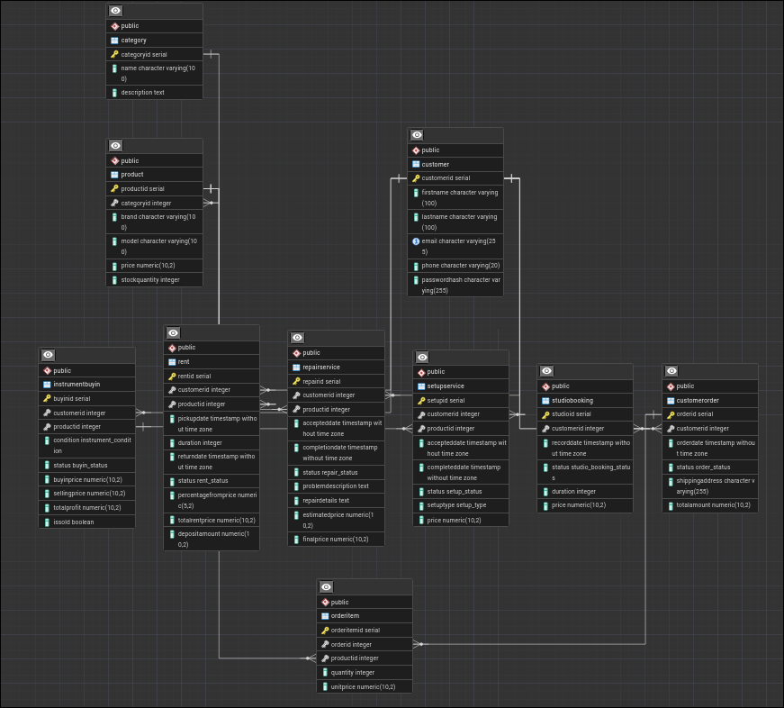

# Лабораторна робота №2

**Тема:** Перетворення ER-діаграми на схему PostgreSQL  
**Виконав:** Вовк Андрій, Троценко Максим, група ІО-41

## Мета роботи
Перетворити ER-діаграму, побудовану в попередній лабораторній роботі, на реляційну схему бази даних у PostgreSQL, реалізувати її засобами SQL та заповнити таблиці тестовими даними.

## Вихідні дані
Основою для побудови реляційної схеми є виправлена ER-діаграма предметної області «Інтернет-магазин гітар», у якій, крім базового функціоналу продажу товарів, передбачено оренду інструментів, запис до студії самозапису, викуп уживаних інструментів, а також послуги ремонту і налаштування.

## Побудована схема бази даних
На основі ER-діаграми було реалізовано десять таблиць:
- `Customer` — клієнти магазину;
- `Category` — категорії товарів;
- `Product` — товари магазину;
- `CustomerOrder` — замовлення клієнтів;
- `OrderItem` — деталі замовлень;
- `Rent` — оренда інструментів;
- `StudioBooking` — записи до студії самозапису;
- `InstrumentBuyIn` — операції викупу вживаних інструментів;
- `RepairService` — послуги ремонту;
- `SetUpService` — послуги налаштування інструментів.

Для забезпечення цілісності даних у схемі використано:
- первинні ключі `PRIMARY KEY` типу `SERIAL` для автоінкременту;
- зовнішні ключі `FOREIGN KEY` для реалізації зв'язків між таблицями;
- обмеження `NOT NULL`, `UNIQUE` і `CHECK`;
- перелічувані типи `ENUM` для атрибутів статусів і фіксованих довідкових значень;
- унікальне обмеження для зв'язку між `Product` і `InstrumentBuyIn`, оскільки після кожного викупу створюється окремий запис у таблиці `Product`.

## Характеристика таблиць

**Таблиця `Customer`** містить інформацію про зареєстрованих клієнтів.  
Поля: `CustomerID`, `FirstName`, `LastName`, `Email`, `Phone`, `PasswordHash`.  
Первинний ключ: `CustomerID`.  
Додаткові обмеження: `Email` є унікальним.

**Таблиця `Category`** описує категорії музичних інструментів.  
Поля: `CategoryID`, `Name`, `Description`.  
Первинний ключ: `CategoryID`.

**Таблиця `Product`** містить інформацію про товари, що доступні для продажу, оренди, викупу, ремонту або налаштування.  
Поля: `ProductID`, `CategoryID`, `Brand`, `Model`, `Price`, `StockQuantity`.  
Первинний ключ: `ProductID`.  
Зовнішній ключ: `CategoryID` → `Category(CategoryID)`.  
Додаткові обмеження: `Price > 0`, `StockQuantity >= 0`.

**Таблиця `CustomerOrder`** зберігає історію оформлених замовлень.  
Поля: `OrderID`, `CustomerID`, `OrderDate`, `Status`, `ShippingAddress`, `TotalAmount`.  
Первинний ключ: `OrderID`.  
Зовнішній ключ: `CustomerID` → `Customer(CustomerID)`.

**Таблиця `OrderItem`** деталізує склад замовлень.  
Поля: `OrderItemID`, `OrderID`, `ProductID`, `Quantity`, `UnitPrice`.  
Первинний ключ: `OrderItemID`.  
Зовнішні ключі: `OrderID` → `CustomerOrder(OrderID)`, `ProductID` → `Product(ProductID)`.  
Додаткові обмеження: `Quantity > 0`, `UnitPrice > 0`; комбінація `(OrderID, ProductID)` є унікальною.

**Таблиця `Rent`** зберігає інформацію про оренду інструментів клієнтами.  
Поля: `RentID`, `CustomerID`, `ProductID`, `PickUpDate`, `Duration`, `ReturnDate`, `Status`, `PercentageFromPrice`, `TotalRentPrice`, `DepositAmount`.  
Первинний ключ: `RentID`.  
Зовнішні ключі: `CustomerID` → `Customer(CustomerID)`, `ProductID` → `Product(ProductID)`.  
Додаткові обмеження: `Duration > 0`, `PercentageFromPrice > 0`, `TotalRentPrice > 0`, `DepositAmount >= 0`, `ReturnDate >= PickUpDate`.

**Таблиця `StudioBooking`** зберігає записи клієнтів до студії самозапису.  
Поля: `StudioID`, `CustomerID`, `RecordDate`, `Status`, `Duration`, `Price`.  
Первинний ключ: `StudioID`.  
Зовнішній ключ: `CustomerID` → `Customer(CustomerID)`.  
Додаткові обмеження: `Duration > 0`, `Price > 0`.

**Таблиця `InstrumentBuyIn`** призначена для обліку викупу вживаних інструментів у клієнтів.  
Поля: `BuyInID`, `CustomerID`, `ProductID`, `Condition`, `Status`, `BuyInPrice`, `SellingPrice`, `TotalProfit`, `IsSold`.  
Первинний ключ: `BuyInID`.  
Зовнішні ключі: `CustomerID` → `Customer(CustomerID)`, `ProductID` → `Product(ProductID)`.  
Додаткові обмеження: `BuyInPrice > 0`, `SellingPrice > 0`, `TotalProfit >= 0`, `ProductID` є унікальним.

**Таблиця `RepairService`** містить інформацію про ремонт інструментів.  
Поля: `RepairID`, `CustomerID`, `ProductID`, `AcceptedDate`, `CompletionDate`, `Status`, `ProblemDescription`, `RepairDetails`, `EstimatedPrice`, `FinalPrice`.  
Первинний ключ: `RepairID`.  
Зовнішні ключі: `CustomerID` → `Customer(CustomerID)`, `ProductID` → `Product(ProductID)`.  
Додаткові обмеження: `EstimatedPrice > 0`, `FinalPrice > 0`, `CompletionDate >= AcceptedDate`.

**Таблиця `SetUpService`** містить інформацію про налаштування інструментів.  
Поля: `SetUpID`, `CustomerID`, `ProductID`, `AcceptedDate`, `CompletedDate`, `Status`, `SetUpType`, `Price`.  
Первинний ключ: `SetUpID`.  
Зовнішні ключі: `CustomerID` → `Customer(CustomerID)`, `ProductID` → `Product(ProductID)`.  
Додаткові обмеження: `Price > 0`, `CompletedDate >= AcceptedDate`.

## SQL-скрипт реалізації
```sql
-- 1. Створення перелічуваних типів
CREATE TYPE order_status AS ENUM ('New', 'Paid', 'Shipped', 'Delivered', 'Cancelled');
CREATE TYPE rent_status AS ENUM ('Active', 'Returned', 'Cancelled');
CREATE TYPE studio_booking_status AS ENUM ('Booked', 'Completed', 'Cancelled');
CREATE TYPE instrument_condition AS ENUM ('LikeNew', 'Excellent', 'Good', 'Fair', 'NeedsRepair');
CREATE TYPE buyin_status AS ENUM ('Accepted', 'Rejected', 'PreparedForSale', 'Sold');
CREATE TYPE repair_status AS ENUM ('Accepted', 'InProgress', 'WaitingForParts', 'Completed', 'Cancelled', 'IssuedToCustomer');
CREATE TYPE setup_status AS ENUM ('Accepted', 'InProgress', 'Completed', 'Cancelled', 'IssuedToCustomer');
CREATE TYPE setup_type AS ENUM ('Basic', 'Full', 'StringsReplacement', 'IntonationAdjustment', 'NeckAdjustment');

-- 2. Створення таблиць
CREATE TABLE Customer (
    CustomerID SERIAL PRIMARY KEY,
    FirstName VARCHAR(100) NOT NULL,
    LastName VARCHAR(100) NOT NULL,
    Email VARCHAR(255) NOT NULL UNIQUE,
    Phone VARCHAR(20),
    PasswordHash VARCHAR(255) NOT NULL
);

CREATE TABLE Category (
    CategoryID SERIAL PRIMARY KEY,
    Name VARCHAR(100) NOT NULL,
    Description TEXT
);

CREATE TABLE Product (
    ProductID SERIAL PRIMARY KEY,
    CategoryID INT NOT NULL,
    Brand VARCHAR(100) NOT NULL,
    Model VARCHAR(100) NOT NULL,
    Price DECIMAL(10, 2) NOT NULL CHECK (Price > 0),
    StockQuantity INT NOT NULL CHECK (StockQuantity >= 0),
    FOREIGN KEY (CategoryID) REFERENCES Category(CategoryID) ON DELETE RESTRICT
);

CREATE TABLE CustomerOrder (
    OrderID SERIAL PRIMARY KEY,
    CustomerID INT NOT NULL,
    OrderDate TIMESTAMP NOT NULL DEFAULT CURRENT_TIMESTAMP,
    Status order_status NOT NULL DEFAULT 'New',
    ShippingAddress VARCHAR(255) NOT NULL,
    TotalAmount DECIMAL(10, 2) NOT NULL CHECK (TotalAmount >= 0),
    FOREIGN KEY (CustomerID) REFERENCES Customer(CustomerID) ON DELETE CASCADE
);

CREATE TABLE OrderItem (
    OrderItemID SERIAL PRIMARY KEY,
    OrderID INT NOT NULL,
    ProductID INT NOT NULL,
    Quantity INT NOT NULL CHECK (Quantity > 0),
    UnitPrice DECIMAL(10, 2) NOT NULL CHECK (UnitPrice > 0),
    FOREIGN KEY (OrderID) REFERENCES CustomerOrder(OrderID) ON DELETE CASCADE,
    FOREIGN KEY (ProductID) REFERENCES Product(ProductID) ON DELETE RESTRICT,
    UNIQUE (OrderID, ProductID)
);

CREATE TABLE Rent (
    RentID SERIAL PRIMARY KEY,
    CustomerID INT NOT NULL,
    ProductID INT NOT NULL,
    PickUpDate TIMESTAMP NOT NULL,
    Duration INT NOT NULL CHECK (Duration > 0),
    ReturnDate TIMESTAMP NOT NULL,
    Status rent_status NOT NULL,
    PercentageFromPrice DECIMAL(5, 2) NOT NULL CHECK (PercentageFromPrice > 0),
    TotalRentPrice DECIMAL(10, 2) NOT NULL CHECK (TotalRentPrice > 0),
    DepositAmount DECIMAL(10, 2) NOT NULL CHECK (DepositAmount >= 0),
    FOREIGN KEY (CustomerID) REFERENCES Customer(CustomerID) ON DELETE CASCADE,
    FOREIGN KEY (ProductID) REFERENCES Product(ProductID) ON DELETE RESTRICT,
    CHECK (ReturnDate >= PickUpDate)
);

CREATE TABLE StudioBooking (
    StudioID SERIAL PRIMARY KEY,
    CustomerID INT NOT NULL,
    RecordDate TIMESTAMP NOT NULL,
    Status studio_booking_status NOT NULL,
    Duration INT NOT NULL CHECK (Duration > 0),
    Price DECIMAL(10, 2) NOT NULL CHECK (Price > 0),
    FOREIGN KEY (CustomerID) REFERENCES Customer(CustomerID) ON DELETE CASCADE
);

CREATE TABLE InstrumentBuyIn (
    BuyInID SERIAL PRIMARY KEY,
    CustomerID INT NOT NULL,
    ProductID INT NOT NULL UNIQUE,
    Condition instrument_condition NOT NULL,
    Status buyin_status NOT NULL,
    BuyInPrice DECIMAL(10, 2) NOT NULL CHECK (BuyInPrice > 0),
    SellingPrice DECIMAL(10, 2) NOT NULL CHECK (SellingPrice > 0),
    TotalProfit DECIMAL(10, 2) NOT NULL CHECK (TotalProfit >= 0),
    IsSold BOOLEAN NOT NULL DEFAULT FALSE,
    FOREIGN KEY (CustomerID) REFERENCES Customer(CustomerID) ON DELETE CASCADE,
    FOREIGN KEY (ProductID) REFERENCES Product(ProductID) ON DELETE RESTRICT
);

CREATE TABLE RepairService (
    RepairID SERIAL PRIMARY KEY,
    CustomerID INT NOT NULL,
    ProductID INT NOT NULL,
    AcceptedDate TIMESTAMP NOT NULL,
    CompletionDate TIMESTAMP NOT NULL,
    Status repair_status NOT NULL,
    ProblemDescription TEXT NOT NULL,
    RepairDetails TEXT NOT NULL,
    EstimatedPrice DECIMAL(10, 2) NOT NULL CHECK (EstimatedPrice > 0),
    FinalPrice DECIMAL(10, 2) NOT NULL CHECK (FinalPrice > 0),
    FOREIGN KEY (CustomerID) REFERENCES Customer(CustomerID) ON DELETE CASCADE,
    FOREIGN KEY (ProductID) REFERENCES Product(ProductID) ON DELETE RESTRICT,
    CHECK (CompletionDate >= AcceptedDate)
);

CREATE TABLE SetUpService (
    SetUpID SERIAL PRIMARY KEY,
    CustomerID INT NOT NULL,
    ProductID INT NOT NULL,
    AcceptedDate TIMESTAMP NOT NULL,
    CompletedDate TIMESTAMP NOT NULL,
    Status setup_status NOT NULL,
    SetUpType setup_type NOT NULL,
    Price DECIMAL(10, 2) NOT NULL CHECK (Price > 0),
    FOREIGN KEY (CustomerID) REFERENCES Customer(CustomerID) ON DELETE CASCADE,
    FOREIGN KEY (ProductID) REFERENCES Product(ProductID) ON DELETE RESTRICT,
    CHECK (CompletedDate >= AcceptedDate)
);

-- 3. Заповнення таблиць тестовими даними
INSERT INTO Customer (FirstName, LastName, Email, Phone, PasswordHash) VALUES
    ('Олександр', 'Шевченко', 'alex.shev@gmail.com', '+380501234567', 'hash_123qwerty'),
    ('Марія', 'Коваленко', 'maria.kov@gmail.com', '+380671234567', 'hash_987asdfgh'),
    ('Іван', 'Бойко', 'ivan.boyko@gmail.com', '+380931234567', 'hash_555zxcvbn'),
    ('Олена', 'Ткачук', 'olena.tk@gmail.com', '+380661234567', 'hash_111poiuyt'),
    ('Андрій', 'Вовк', 'andriy.vovk@io41.edu.ua', '+380991234567', 'hash_mysecurepass');

INSERT INTO Category (Name, Description) VALUES
    ('Електрогітари', 'Гітари із суцільним корпусом та магнітними звукознімачами'),
    ('Акустичні гітари', 'Класичні та естрадні акустичні гітари з дерев''яним корпусом'),
    ('Бас-гітари', 'Чотири- та п''ятиструнні бас-гітари'),
    ('Укулеле', 'Маленькі чотириструнні гавайські гітари');

INSERT INTO Product (CategoryID, Brand, Model, Price, StockQuantity) VALUES
    (1, 'Fender', 'Stratocaster Player', 35000.00, 10),
    (1, 'Gibson', 'Les Paul Standard', 95000.00, 3),
    (2, 'Yamaha', 'F310', 6500.00, 25),
    (2, 'Taylor', '114ce', 42000.00, 5),
    (3, 'Cort', 'Action Bass Plus', 8500.00, 12),
    (1, 'Ibanez', 'RG421 Used', 18000.00, 1),
    (2, 'Takamine', 'GD20 Used', 9000.00, 1);

INSERT INTO CustomerOrder (CustomerID, Status, ShippingAddress, TotalAmount) VALUES
    (1, 'New', 'Київ, вул. Хрещатик, 15, кв. 4', 35000.00),
    (2, 'Paid', 'Львів, пл. Ринок, 10, кв. 2', 13000.00),
    (3, 'Shipped', 'Одеса, вул. Дерибасівська, 5', 95000.00),
    (4, 'New', 'Київ, вул. Богатирська 34/12', 12500.00),
    (4, 'Shipped', 'Київ, вул. Виноградарська 44а, кв. 76', 35000.00);

INSERT INTO OrderItem (OrderID, ProductID, Quantity, UnitPrice) VALUES
    (1, 1, 1, 35000.00),
    (2, 3, 2, 6500.00),
    (3, 2, 1, 95000.00);

INSERT INTO Rent (CustomerID, ProductID, PickUpDate, Duration, ReturnDate, Status, PercentageFromPrice, TotalRentPrice, DepositAmount) VALUES
    (2, 1, '2026-03-20 10:00:00', 7, '2026-03-27 10:00:00', 'Returned', 10.00, 3500.00, 5000.00),
    (4, 4, '2026-03-25 12:00:00', 3, '2026-03-28 12:00:00', 'Active', 8.00, 3360.00, 6000.00);

INSERT INTO StudioBooking (CustomerID, RecordDate, Status, Duration, Price) VALUES
    (1, '2026-03-29 14:00:00', 'Booked', 2, 1200.00),
    (5, '2026-03-22 16:00:00', 'Completed', 3, 1800.00);

INSERT INTO InstrumentBuyIn (CustomerID, ProductID, Condition, Status, BuyInPrice, SellingPrice, TotalProfit, IsSold) VALUES
    (3, 6, 'Good', 'PreparedForSale', 12000.00, 18000.00, 6000.00, FALSE),
    (4, 7, 'Fair', 'Sold', 6000.00, 9000.00, 3000.00, TRUE);

INSERT INTO RepairService (CustomerID, ProductID, AcceptedDate, CompletionDate, Status, ProblemDescription, RepairDetails, EstimatedPrice, FinalPrice) VALUES
    (2, 2, '2026-03-18 11:00:00', '2026-03-22 15:00:00', 'Completed', 'Не працює перемикач звукознімачів', 'Замінено перемикач та виконано перевірку електроніки', 1500.00, 1700.00),
    (5, 6, '2026-03-26 10:30:00', '2026-03-29 18:00:00', 'InProgress', 'Потрібне усунення брязкоту ладів', 'Виконується шліфування ладів та загальна діагностика', 1800.00, 2200.00);

INSERT INTO SetUpService (CustomerID, ProductID, AcceptedDate, CompletedDate, Status, SetUpType, Price) VALUES
    (1, 1, '2026-03-17 09:00:00', '2026-03-17 13:00:00', 'Completed', 'Full', 1200.00),
    (3, 3, '2026-03-24 10:00:00', '2026-03-24 12:00:00', 'IssuedToCustomer', 'StringsReplacement', 500.00);
```

## Перевірка заповнення таблиць
Після створення таблиць та додавання тестових записів виконано перевірку вмісту таблиць за допомогою запитів виду:

```sql
SELECT * FROM Customer;
SELECT * FROM Category;
SELECT * FROM Product;
SELECT * FROM CustomerOrder;
SELECT * FROM OrderItem;
SELECT * FROM Rent;
SELECT * FROM StudioBooking;
SELECT * FROM InstrumentBuyIn;
SELECT * FROM RepairService;
SELECT * FROM SetUpService;
```

За результатами виконання запитів було перевірено коректність створення таблиць, роботу первинних і зовнішніх ключів, а також відповідність тестових записів заданим обмеженням.

Також після реалізації схеми в pgAdmin може бути згенерована ERD на основі створеної бази даних для підтвердження правильності зв'язків між таблицями.

<div align="center">
  
  <p><em>ER-діаграма бази даних, згенерована в pgAdmin</em></p>
</div>

## Висновок
У ході виконання лабораторної роботи виправлену концептуальну ER-діаграму інтернет-магазину гітар було перетворено на реляційну схему бази даних у PostgreSQL. Було створено десять взаємопов'язаних таблиць, визначено первинні та зовнішні ключі, встановлено обмеження цілісності для числових значень, дат і статусів, а також додано тестові записи для перевірки працездатності схеми. Отримана база даних відповідає розширеній предметній області та може бути використана як основа для подальшої розробки застосунку.
