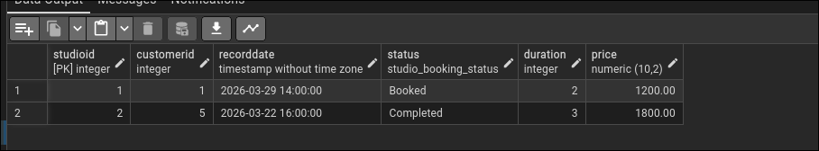
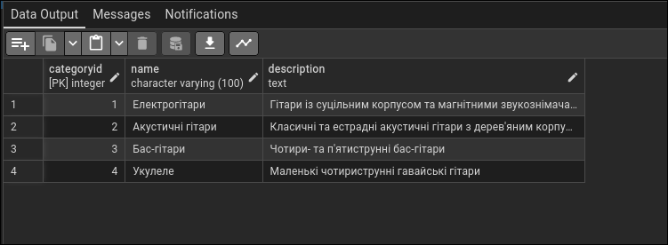
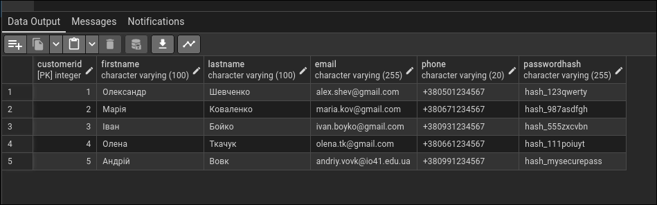
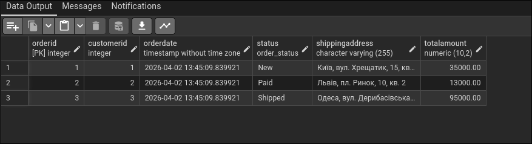
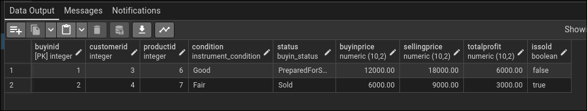

# Лабораторна робота №2

**Тема:** Перетворення ER-діаграми на схему PostgreSQL  
**Виконав:** Вовк Андрій,Троценко Максим, група ІО-41

## Мета роботи
Перетворити ER-діаграму, побудовану в попередній лабораторній роботі, на реляційну схему бази даних у PostgreSQL, реалізувати її засобами SQL та заповнити таблиці тестовими даними.

## Вихідні дані
Основою для побудови реляційної схеми є ER-діаграма предметної області "Інтернет-магазин гітар", отримана в попередній лабораторній роботі.

## Побудована схема бази даних
На основі ER-діаграми було реалізовано п'ять таблиць:
- `Customer` — клієнти магазину;
- `Category` — категорії товарів (гітар);
- `Product` — товари (гітари);
- `CustomerOrder` — замовлення клієнтів;
- `OrderItem` — деталі замовлень (проміжна таблиця для реалізації зв'язку багато-до-багатьох).

Для забезпечення цілісності даних використано:
- первинні ключі `PRIMARY KEY` типу `SERIAL` для автоінкременту;
- зовнішні ключі `FOREIGN KEY` з правилами поведінки `ON DELETE CASCADE` та `ON DELETE RESTRICT`;
- обмеження `NOT NULL`, `UNIQUE` і `CHECK`;
- перелічуваний тип `order_status` для атрибута статусу замовлення.

## Характеристика таблиць

**Таблиця `Customer`** містить інформацію про зареєстрованих клієнтів.  
Поля: `CustomerID`, `FirstName`, `LastName`, `Email`, `Phone`, `PasswordHash`.  
Первинний ключ: `CustomerID`.  
Додаткові обмеження: `Email` є унікальним.

**Таблиця `Category`** описує категорії музичних інструментів.  
Поля: `CategoryID`, `Name`, `Description`.  
Первинний ключ: `CategoryID`.

**Таблиця `Product`** містить інформацію про гітари, доступні для продажу.  
Поля: `ProductID`, `CategoryID`, `Brand`, `Model`, `Price`, `StockQuantity`.  
Первинний ключ: `ProductID`.  
Зовнішній ключ: `CategoryID` → `Category(CategoryID)`.  
Додаткові обмеження: `Price > 0`, `StockQuantity >= 0`.

**Таблиця `CustomerOrder`** зберігає історію оформлених замовлень.  
Поля: `OrderID`, `CustomerID`, `OrderDate`, `Status`, `ShippingAddress`, `TotalAmount`.  
Первинний ключ: `OrderID`.  
Зовнішній ключ: `CustomerID` → `Customer(CustomerID)`.

**Таблиця `OrderItem`** деталізує, які саме товари входять до конкретного замовлення.  
Поля: `OrderItemID`, `OrderID`, `ProductID`, `Quantity`, `UnitPrice`.  
Первинний ключ: `OrderItemID`.  
Зовнішні ключі: `OrderID` → `CustomerOrder(OrderID)`, `ProductID` → `Product(ProductID)`.  
Додаткові обмеження: `Quantity > 0`, `UnitPrice > 0`; комбінація `(OrderID, ProductID)` є унікальною.

## SQL-скрипт реалізації
```sql
-- 1. Створення типу даних
CREATE TYPE order_status AS ENUM ('New', 'Paid', 'Shipped', 'Delivered', 'Cancelled');

-- 2. Створення таблиць
CREATE TABLE Customer (
    CustomerID SERIAL PRIMARY KEY,
    FirstName VARCHAR(100) NOT NULL,
    LastName VARCHAR(100) NOT NULL,
    Email VARCHAR(255) NOT NULL UNIQUE,
    Phone VARCHAR(20),
    PasswordHash VARCHAR(255) NOT NULL
);

CREATE TABLE Category (
    CategoryID SERIAL PRIMARY KEY,
    Name VARCHAR(100) NOT NULL,
    Description TEXT
);

CREATE TABLE Product (
    ProductID SERIAL PRIMARY KEY,
    CategoryID INT NOT NULL,
    Brand VARCHAR(100) NOT NULL,
    Model VARCHAR(100) NOT NULL,
    Price DECIMAL(10, 2) NOT NULL CHECK (Price > 0),
    StockQuantity INT NOT NULL CHECK (StockQuantity >= 0),
    FOREIGN KEY (CategoryID) REFERENCES Category(CategoryID) ON DELETE RESTRICT
);

CREATE TABLE CustomerOrder (
    OrderID SERIAL PRIMARY KEY,
    CustomerID INT NOT NULL,
    OrderDate TIMESTAMP DEFAULT CURRENT_TIMESTAMP,
    Status order_status NOT NULL DEFAULT 'New',
    ShippingAddress VARCHAR(255) NOT NULL,
    TotalAmount DECIMAL(10, 2),
    FOREIGN KEY (CustomerID) REFERENCES Customer(CustomerID) ON DELETE CASCADE
);

CREATE TABLE OrderItem (
    OrderItemID SERIAL PRIMARY KEY,
    OrderID INT NOT NULL,
    ProductID INT NOT NULL,
    Quantity INT NOT NULL CHECK (Quantity > 0),
    UnitPrice DECIMAL(10, 2) NOT NULL CHECK (UnitPrice > 0),
    FOREIGN KEY (OrderID) REFERENCES CustomerOrder(OrderID) ON DELETE CASCADE,
    FOREIGN KEY (ProductID) REFERENCES Product(ProductID) ON DELETE RESTRICT,
    UNIQUE (OrderID, ProductID)
);

-- 3. Заповнення таблиць тестовими даними
INSERT INTO Customer (FirstName, LastName, Email, Phone, PasswordHash) VALUES
    ('Олександр', 'Шевченко', 'alex.shev@gmail.com', '+380501234567', 'hash_123qwerty'),
    ('Марія', 'Коваленко', 'maria.kov@gmail.com', '+380671234567', 'hash_987asdfgh'),
    ('Іван', 'Бойко', 'ivan.boyko@gmail.com', '+380931234567', 'hash_555zxcvbn'),
    ('Олена', 'Ткачук', 'olena.tk@gmail.com', '+380661234567', 'hash_111poiuyt'),
    ('Андрій', 'Вовк', 'andriy.vovk@io41.edu.ua', '+380991234567', 'hash_mysecurepass');

INSERT INTO Category (Name, Description) VALUES
    ('Електрогітари', 'Гітари із суцільним корпусом та магнітними звукознімачами'),
    ('Акустичні гітари', 'Класичні та естрадні акустичні гітари з дерев''яним корпусом'),
    ('Бас-гітари', 'Чотири- та п''ятиструнні бас-гітари'),
    ('Укулеле', 'Маленькі чотириструнні гавайські гітари');

INSERT INTO Product (CategoryID, Brand, Model, Price, StockQuantity) VALUES
    (1, 'Fender', 'Stratocaster Player', 35000.00, 10),
    (1, 'Gibson', 'Les Paul Standard', 95000.00, 3),
    (2, 'Yamaha', 'F310', 6500.00, 25),
    (2, 'Taylor', '114ce', 42000.00, 5),
    (3, 'Cort', 'Action Bass Plus', 8500.00, 12);

INSERT INTO CustomerOrder (CustomerID, Status, ShippingAddress, TotalAmount) VALUES
    (1, 'New', 'Київ, вул. Хрещатик, 15, кв. 4', 35000.00),
    (2, 'Paid', 'Львів, пл. Ринок, 10, кв. 2', 13000.00),
    (3, 'Shipped', 'Одеса, вул. Дерибасівська, 5', 95000.00);

INSERT INTO OrderItem (OrderID, ProductID, Quantity, UnitPrice) VALUES
    (1, 1, 1, 35000.00),
    (2, 3, 2, 6500.00),
    (3, 2, 1, 95000.00);
```

## Перевірка заповнення таблиць
Після створення таблиць та додавання тестових записів виконано перевірку вмісту таблиць за допомогою запитів виду:

```sql
SELECT * FROM Customer;
SELECT * FROM Category;
SELECT * FROM Product;
SELECT * FROM CustomerOrder;
SELECT * FROM OrderItem;
```











Також продемонструємо згенеровану ERD на основі створеної бази даних, згенеровану за допомогою інструмента в pgAdmin:

<div align="center">
  
</div>

## Висновок
У ході виконання лабораторної роботи концептуальну ER-діаграму інтернет-магазину гітар було успішно перетворено на реляційну схему бази даних у PostgreSQL. Було створено таблиці, визначено первинні та зовнішні ключі, встановлено обмеження цілісності типів і значень, а також додано тестові записи до кожної таблиці. Отримана схема повністю відповідає заданій предметній області та готова до використання.
