# Лабораторна робота №3

**Тема:** Маніпулювання даними SQL (OLTP)  
**Виконав:** Вовк Андрій, Троценко Максим, група ІО-41

## Мета роботи
Написати запити `SELECT` для отримання даних, включаючи фільтрацію за допомогою `WHERE` та вибір певних стовпців.  
Практикувати використання операторів `INSERT` для додавання нових рядків до таблиць.  
Практикувати використання оператора `UPDATE` для зміни існуючих рядків з використанням `SET` та `WHERE`.  
Практикувати використання оператора `DELETE` для безпечного видалення рядків за допомогою `WHERE`.  
Вивчити основні операції маніпулювання даними (`DML`) у PostgreSQL та спостерігати за їхнім впливом.

## Вихідні дані
Основою для побудови реляційної схеми є виправлена ER-діаграма предметної області «Інтернет-магазин гітар», у якій, крім базового функціоналу продажу товарів, передбачено оренду інструментів, запис до студії самозапису, викуп уживаних інструментів, а також послуги ремонту і налаштування.

## Заповнимо таблиці даними

```sql
INSERT INTO Customer (FirstName, LastName, Email, Phone, PasswordHash) VALUES
    ('Олександр', 'Шевченко', 'alex.shev@gmail.com', '+380501234567', 'hash_123qwerty'),
    ('Марія', 'Коваленко', 'maria.kov@gmail.com', '+380671234567', 'hash_987asdfgh'),
    ('Іван', 'Бойко', 'ivan.boyko@gmail.com', '+380931234567', 'hash_555zxcvbn'),
    ('Олена', 'Ткачук', 'olena.tk@gmail.com', '+380661234567', 'hash_111poiuyt'),
    ('Андрій', 'Вовк', 'andriy.vovk@io41.edu.ua', '+380991234567', 'hash_mysecurepass'),
    ('Максим', 'Троценко', 'trotsenko.maksym@io41.edu.ua', '+380991234567', 'hash_mysecurepass');

INSERT INTO Category (Name, Description) VALUES
    ('Електрогітари', 'Гітари із суцільним корпусом та магнітними звукознімачами'),
    ('Акустичні гітари', 'Класичні та естрадні акустичні гітари з дерев''яним корпусом'),
    ('Бас-гітари', 'Чотири- та п''ятиструнні бас-гітари'),
    ('Укулеле', 'Маленькі чотириструнні гавайські гітари');

INSERT INTO Product (CategoryID, Brand, Model, Price, StockQuantity) VALUES
    (1, 'Fender', 'Stratocaster Player', 35000.00, 10),
    (1, 'Gibson', 'Les Paul Standard', 95000.00, 3),
    (1, 'Fender', 'Telecaster Custom', 54000.00, 2),
    (2, 'Yamaha', 'F310', 6500.00, 25),
    (2, 'Taylor', '114ce', 42000.00, 5),
    (3, 'Cort', 'Action Bass Plus', 8500.00, 12),
    (1, 'Ibanez', 'RG421 Used', 18000.00, 1),
    (2, 'Takamine', 'GD20 Used', 9000.00, 1);

INSERT INTO CustomerOrder (CustomerID, Status, ShippingAddress, TotalAmount) VALUES
    (1, 'New', 'Київ, вул. Хрещатик, 15, кв. 4', 35000.00),
    (2, 'Paid', 'Львів, пл. Ринок, 10, кв. 2', 13000.00),
    (3, 'Shipped', 'Одеса, вул. Дерибасівська, 5', 95000.00),
    (4, 'New', 'Київ, вул. Богатирська 34/12', 12500.00),
    (5, 'Shipped', 'Київ, вул. Виноградарська 44а, кв. 76', 35000.00);

INSERT INTO OrderItem (OrderID, ProductID, Quantity, UnitPrice) VALUES
    (1, 1, 1, 35000.00),
    (2, 3, 2, 13000.00),
    (3, 2, 1, 95000.00);

INSERT INTO Rent (CustomerID, ProductID, PickUpDate, Duration, ReturnDate, Status, PercentageFromPrice, TotalRentPrice, DepositAmount) VALUES
    (2, 1, '2026-03-20 10:00:00', 7, '2026-03-27 10:00:00', 'Returned', 10.00, 3500.00, 5000.00),
    (4, 4, '2026-03-25 12:00:00', 3, '2026-03-28 12:00:00', 'Active', 8.00, 3360.00, 6000.00);

INSERT INTO StudioBooking (CustomerID, RecordDate, Status, Duration, Price) VALUES
    (1, '2026-03-29 14:00:00', 'Booked', 2, 1200.00),
    (5, '2026-03-22 16:00:00', 'Completed', 3, 1800.00),
    (2, '2026-04-08 18:00:00', 'Booked', 3, 1800.00),
    (3, '2026-04-08 14:00:00', 'Completed', 2, 1200.00),
    (2, '2026-04-10 14:00:00', 'Booked', 2, 1200.00),
    (4, '2026-04-10 16:00:00', 'Booked', 3, 1800.00);

INSERT INTO InstrumentBuyIn (CustomerID, ProductID, Condition, Status, BuyInPrice, SellingPrice, TotalProfit, IsSold) VALUES
    (3, 6, 'Good', 'PreparedForSale', 12000.00, 18000.00, 6000.00, FALSE),
    (4, 7, 'Fair', 'Sold', 6000.00, 9000.00, 3000.00, TRUE);

INSERT INTO RepairService (CustomerID, ProductID, AcceptedDate, CompletionDate, Status, ProblemDescription, RepairDetails, EstimatedPrice, FinalPrice) VALUES
    (2, 2, '2026-03-18 11:00:00', '2026-03-22 15:00:00', 'Completed', 'Не працює перемикач звукознімачів', 'Замінено перемикач та виконано перевірку електроніки', 1500.00, 1700.00),
    (5, 6, '2026-03-26 10:30:00', '2026-03-29 18:00:00', 'InProgress', 'Потрібне усунення брязкоту ладів', 'Виконується шліфування ладів та загальна діагностика', 1800.00, 2200.00);

INSERT INTO SetUpService (CustomerID, ProductID, AcceptedDate, CompletedDate, Status, SetUpType, Price) VALUES
    (1, 1, '2026-03-17 09:00:00', '2026-03-17 13:00:00', 'Completed', 'Full', 1200.00),
    (3, 3, '2026-03-24 10:00:00', '2026-03-24 12:00:00', 'IssuedToCustomer', 'StringsReplacement', 500.00);
```

### Перевірка заповнення таблиць

```sql
SELECT * FROM Customer;
```

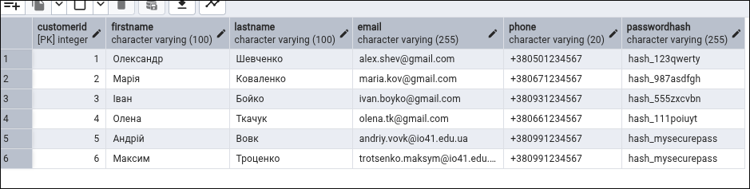

```sql
SELECT * FROM CustomerOrder;
```

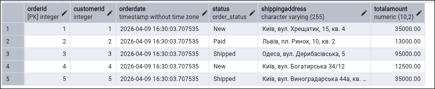

```sql
SELECT * FROM Product;
```

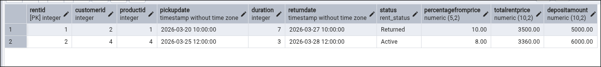

## SELECT — отримання даних

```sql
SELECT FirstName, LastName
FROM Customer
WHERE Email LIKE '%@io41.edu.ua';
```

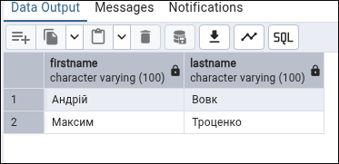

```sql
SELECT Brand, Model, Price, StockQuantity
FROM Product
WHERE CategoryID = 1;
```

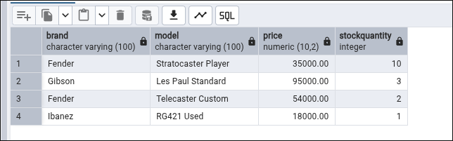

```sql
SELECT Model
FROM Product
WHERE Brand = 'Fender';
```

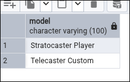


```sql
SELECT PickUpDate, Duration, Status
FROM Rent;
```

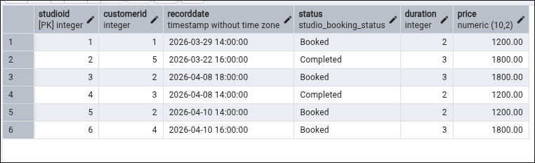

```sql
SELECT Status
FROM StudioBooking
WHERE RecordDate >= '2026-04-01'
  AND RecordDate < '2026-05-01';
```

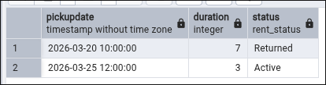

```sql
SELECT *
FROM SetUpService;
```

## UPDATE — зміна даних

```sql
UPDATE StudioBooking
SET Status = 'Completed'
WHERE RecordDate = '2026-04-08 18:00:00';
```


```sql
SELECT *
FROM StudioBooking
WHERE RecordDate = '2026-04-08 18:00:00';
```

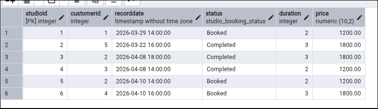

```sql
UPDATE Product
SET StockQuantity = 1
WHERE Model = 'Telecaster Custom';
```

```sql
SELECT *
FROM Product
WHERE Model = 'Telecaster Custom';
```

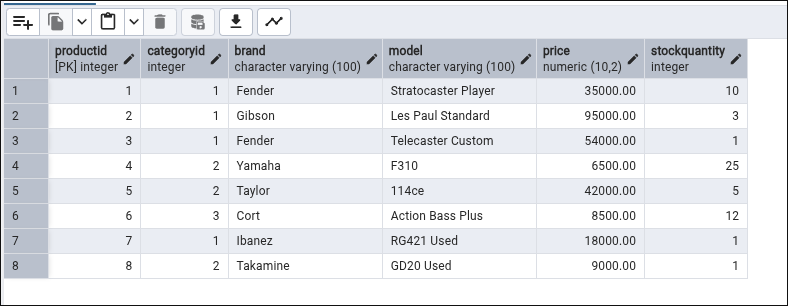

## DELETE — видалення даних

```sql
DELETE FROM StudioBooking
WHERE Status = 'Booked'
  AND RecordDate >= '2026-04-10 00:00:00'
  AND RecordDate < '2026-04-11 00:00:00';
```

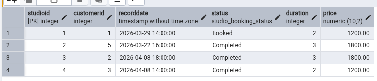

```sql
SELECT *
FROM StudioBooking
WHERE RecordDate >= '2026-04-10 00:00:00'
  AND RecordDate < '2026-04-11 00:00:00';
```

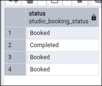

## Висновок
У ході виконання лабораторної роботи було опрацьовано основні оператори маніпулювання даними в PostgreSQL: `INSERT`, `SELECT`, `UPDATE` та `DELETE`. Було виконано заповнення таблиць тестовими даними, здійснено вибірки з використанням умов `WHERE`, змінено значення окремих полів за допомогою `UPDATE`, а також безпечно видалено записи з використанням умов у `DELETE`. Отримані результати підтверджують коректність виконаних SQL-запитів і демонструють практичне застосування DML-операцій у реляційній базі даних.
